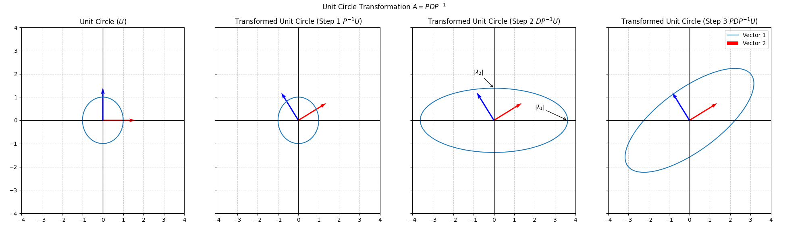

## Week 1 Monday Bridge

The Pacinian corpuscle detects deep pressure, touch, and high frequency vibrations around 250 Hz. At a 1 kHz sampling rate, we will get 4 samples per cycle, which is above the Nyquist frequency. An open question is if that sampling rate is enough for our purposes. Eigendecomposition of the accelerometer covariance matrix could identify redundant sensing axes before developing classification methods.

## Week 1 Tuesday Bridge

One simplified measure of correct dental hygiene technique can be defined by amount of force applied during cleaning ($F\in[F_{min},F_{max}]$). The observed force ($F_{obs}$) can fall into one of three possible events $\{A:F_{obs} \lt F_{min};\ B:F_{min} <= F_{obs} \le F_{max};\ C:F_{max} \lt F_{obs}\}$, where the event for the correct technique is $Event\ B$. Each of these events are disjoint, so $P(A)+P(B)+P(C) = 1$.

## Week 1 Wednesday Notes

Focus of todays Linear Algebra work is Diagonalization ($A = PDP^{-1}$) where P is the matrix of eigenvectors and D is a diagonal matrix where the diagonals are the eigenvalues. The eigenvectors and eigenvalues must be in the same order. Completed the proof diagonalization. Calculated examples that demonstrated diagonalization. Also proved that $A^n = PD^nP^{-1}$. A brute force hand calculation of $A^3$ and $PD^nP{-1}$ confirmed this relationship. 

$$
A=\begin{bmatrix}
3 & 1 \\
0 & 2
\end{bmatrix}
$$
$$
P=\begin{bmatrix}
1 & -1 \\
0 & 1
\end{bmatrix}
; 
D=\begin{bmatrix}
3 & 0 \\
0 & 2
\end{bmatrix}
;P^{-1}=
\begin{bmatrix}
1 & 1 \\
0 & 1
\end{bmatrix}
$$
$$
A^3 = \begin{bmatrix}
3 & 1 \\
0 & 2
\end{bmatrix}\begin{bmatrix}
3 & 1 \\
0 & 2
\end{bmatrix}\begin{bmatrix}
3 & 1 \\
0 & 2
\end{bmatrix}
$$
$$
A^3 = \begin{bmatrix}
9 & 5 \\
0 & 4
\end{bmatrix}\begin{bmatrix}
3 & 1 \\
0 & 2
\end{bmatrix} = \begin{bmatrix}
27 & 19 \\
0 & 8
\end{bmatrix}
$$
$$
A^3 = \begin{bmatrix}
27 & 19 \\
0 & 8
\end{bmatrix} 
=\begin{bmatrix}
1 & -1 \\
0 & 1
\end{bmatrix}
\begin{bmatrix}
3 & 0 \\
0 & 2
\end{bmatrix}^3
\begin{bmatrix}
1 & 1 \\
0 & 1
\end{bmatrix}
$$
$$
A^3 = \begin{bmatrix}
27 & 19 \\
0 & 8
\end{bmatrix} 
=\begin{bmatrix}
1 & -1 \\
0 & 1
\end{bmatrix}
\begin{bmatrix}
27 & 0 \\
0 & 8
\end{bmatrix}
\begin{bmatrix}
1 & 1 \\
0 & 1
\end{bmatrix}
$$
$$
A^3 = \begin{bmatrix}
27 & 19 \\
0 & 8
\end{bmatrix} 
=\begin{bmatrix}
27 & 19 \\
0 & 8
\end{bmatrix}
$$

I calculated the Fibonnaci eigenvalues as well. The Fibonacci Matrix is: 

$$
F = \begin{bmatrix}
1 & 1 \\
1 & 0
\end{bmatrix} 
$$

The eigenvalues and eigenvectors are:

$$\lambda_{1}=\frac{1+\sqrt{5}}{2} \approx 1.618$$

$$
v_1 = 
\begin{bmatrix}
\frac{1+\sqrt{5}}{2}\\ 
1
\end{bmatrix} 
$$

$$\lambda_{2}=\frac{1-\sqrt{5}}{2} \approx -0.618$$

$$v_2 = 
\begin{bmatrix}
\frac{1-\sqrt{5}}{2}\\ 
1
\end{bmatrix} 
$$

Notice that the eigenvalue of $\lambda_1$ is the golden ratio.

## Week1 Thursday Notes
### Strang 5.3 Difference Equations and Powers $A^k$
A stable discrete system must have $|\lambda|<1$ for all eigenvalues. In the white cane project, if this does not happen and the $|\lambda|\ge1$, then the haptic signal will grow without bound.

Worked examples for difference equations:
### Example - Symmetric 
$$
A = \begin{bmatrix}
2 & 0 \\
0 & 1
\end{bmatrix} 
$$

The eigenvalues and eigenvectors are:

$$\lambda_{1}=2; \lambda_2=1$$

$$
v_1 = 
\begin{bmatrix}
1\\ 
0
\end{bmatrix} 
$$

$$
v_2 = 
\begin{bmatrix}
0 \\ 
1
\end{bmatrix} 
$$

The general solution is:

$$
u_k=c_1 \cdot 2^k \cdot \begin{bmatrix}
1 \\
0
\end{bmatrix} + c_2 \cdot \begin{bmatrix}
0 \\
1
\end{bmatrix}
$$

Long term behavior is exponential growth.

### Example 2 - Shear
$$
A = \begin{bmatrix}
1 & 1 \\
0 & 1
\end{bmatrix} 
$$

The eigenvalues and eigenvectors are:

$$\lambda_{1}=1; \lambda_2=1$$

$$
v_1 = 
\begin{bmatrix}
1\\ 
0
\end{bmatrix} 
$$

The general solution is:

$$
u_k = (c_1 + c_2 k) \cdot \begin{bmatrix}
1\\
0
\end{bmatrix}
$$

Long term behavior is linear growth.

### Example 3 - Scaled Rotation
$$
A = \begin{bmatrix}
0 & -0.5 \\
0.5 & 0
\end{bmatrix} 
$$

The eigenvalues and eigenvectors are:

$$\lambda_{1}=0.5i; \lambda_2=-0.5i$$

$$
v_1 = 
\begin{bmatrix}
i\\ 
1
\end{bmatrix} 
$$

$$
v_2 = 
\begin{bmatrix}
1\\ 
i
\end{bmatrix} 
$$

The general solution is:

$$
u_k=c_1 \cdot (0.5i)^k \cdot \begin{bmatrix}
i \\
1
\end{bmatrix} + c_2 \cdot (-0.5i)^k \cdot \begin{bmatrix}
1 \\
i
\end{bmatrix}
$$

Long term behavior is a stable spiral to zero.

### Summary of Examples
| Matrix | Eigenvalues | $\lambda$ Magnitude | Long-term Behavior |
|---|---|---|---|
| Symmetric | 2, 1 | ≥1 | Exponential growth |
| Shear (defective) | 1, 1 | =1 | Linear growth |
| Scaled Rotation | ±0.5i | <1 | Stable spiral to 0 |

### Probability Notes
$$ P(A|B) = \frac{P(A \cap B)}{P(B)}$$
$$ P(B|A) = \frac{P(A \cap B)}{P(A)} $$ 
Rearrange P(A|B) to get: 
$$ P(A \cap B) = P(A|B)P(B)$$ 
Substitute into P(B|A) to get: 
$$ P(B|A) = \frac{P(A|B)P(B)}{P(A)}$$

For the white cane project, the bayes texture classifier can be written as: 

$$P(Surface_i|Sensor)=\frac{P(Sensor|Surface_i)P(Surface_i)}{\sum_{j \in Surface\ Type} P(Sensor|Surface_j)P(Surface_j))}$$

Two possible priors to be used for the classifier:

$Informative\ Prior:P(Surface_i) \propto Surface\ Area\ Frequency$ - encodes real environment knowledge

$Uniform\ prior: P(Surface_i) = 1/4$ - reduces classifier to maximum likelihood (assumes 4 surfaces)

## Week 1 Friday Notes
### Strang 5.4 Differential Equations and $e^{At}$ 
| System | Stable | Marginally Stable | Unstable |
|---|---|---|---|
| Discrete (A^k) | \|λ\| < 1 | \|λ\| = 1 | \|λ\| > 1 |
| Continuous (e^At) | Re(λ) < 0 | Re(λ) = 0 | Re(λ) > 0 |

The stability of a haptic spring wall is determined by the real parts of the eigenvalues, which come from the ODE and the physical parameters of the system (specifically damping).

Hermitian: $A^H = A$ - complex conjugate appears in the symmetric position across the diagonal. Generalizes symmetric matrices.
Unitary:  $U^HU = I$ - orthonormal columns in the complex sense. Generalizes orthogonal matrices.

### Systems and Signals Classification
#### Even and Odd Decomposition
An even signal is defined by $x(t)=x(-t)$ and an odd signal is defined by $x(t)=-x(-t)$.

Any arbitrary signal can be decomposed into an even and odd signal.

$$x_e(t)=\frac{x(t)+x(-t)}{2}$$

$$x_o(t)=\frac{x(t)-x(-t)}{2}$$

$$x(t) = x_e(t) + x_o(t)$$

#### Linearity
Two conditions must be met:
1. Additivity ($x(t_1+t_2)=x(t_1)+x(t_2)$)
2. Homogeneity ($x(at)=ax(t)$)

Combined the check is:

$$T(ax_1 + bx_2) = aT(x_1) + bT(x_2)$$

#### Example 1- $y(t) = x(t) + 1$

$$y(t_1+t_2)=x(t_1+t_2)+1$$ 

$$y(t_1)+y(t_2) = x(t_1)+1+x(t_2)+1=x(t_1+t_2)+2$$

Not Additive. If it were additive, then those two equations would be equal to each other

$$y(at)=x(at)+1=ax(t)+1$$

$$ay(t)=a(x(t)+1)=ax(t)+a$$ 

Again those two don't equal and so it doesn't have homogeneity

#### Example 2 - $y(t)=3x(t)$

$$y(t_1+t_2)=3x(t_1+t_2)$$ 
$$y(t_1)+y(t_2) = 3x(t_1)+3x(t_2)=3x(t_1+t_2)$$

These equal so they are linear.

$$y(at) = 3x(at) = 3ax(t)$$
$$ay(t)=a(3x(t))=3ax(t)$$ 

These are also equal so it has homogeneity. This is linear.

#### Example 3 - $y(t) = x^2(t)$
$$y(t_1+t_2)=x(t_1+t_2)x(t_1+t_2)=x^2(t_1+t_2)$$ 
$$y(t_1)+y(t_2)=x(t_1)x(t_1)+x(t_2)x(t_2)=x^2(t_1)+x^2(t_2)$$ 

These are not equal to each other, so it is not additive and therefore not linear.

The white cane classifier is not linear since energy and power calculations involve squaring operations.

#### Time Invariance

$If x(t)\rightarrow y(t), then x(t−t_0) \rightarrow y(t−t_0​)$
#### Example 4 - $y(t)=3x(t)$
1. Replace $x(t)$ with $x(t-t_0)$: $3x(t-t_0)$
2. Take original input $y(t)=3x(t)$ and shift it by $t_0$: $y(t-t_0) = 3x(t-t_0)$
They are equal, so it is Time-Invariant

#### Example 5 - $y(t)=x(2t)$
1. Replace $x(t)$ with $x(2(t-t_0)) = x(2t-2t_0)$
2. Take original input $y(t)=x(2t)$ and shift it by $t_0$: $y(t-t_0) = x(2t-t_0)$
These are not equal, so it is not time-invariant.

#### Causality
$y(t)$ depends only on $x(\tau)$ for $\tau \le t$

$x(t - a)$ for $a > 0 \rightarrow$ past $\rightarrow$ causal

$x(t) \rightarrow$ present $\rightarrow$ causal 

$x(t + a)$ for $a > 0 \rightarrow$ future $rightarrow$ not causal

#### Example 6

$y(t) = x(t - 1)$ looks into the past, so it is causal.

$y(t) = x(t + 1)$ looks into the future, so it is not causal.

#### Stability
BIBO stability- Bounded Input always produces a Bounded Output

if $|x(t)| \le M$ for all t, then $|y(t)| \le K$ for all t, where M and K are finite constants
#### Example 7 - Are these BIBO?
1. $y(t) = 3x(t)$

   -This is stable. If the input is bounded then the output is only 3 times larger than the bounded input.
2. $y(t) = \frac{1}{x(t)}$

   -This is unstable. If the input is extremely small or approaches zero, then the output explodes

#### Summary on Classification
| Property | Condition | Fails When |
|---|---|---|
| Linearity | T{ax1 + bx2} = aT{x1} + bT{x2} | Offset, squaring, any nonlinearity |
| Time-invariance | x(t-t0) -> y(t-t0) | Time scaling x(at) |
| Causality | Output depends only on x(t), t <= t | Future input x(t+a) |
| Stability (BIBO) | Bounded input -> bounded output | Division, exponential growth |

### Law Ch.4.4-4.5 Estimation of Means, Variances, Correlations. CIs for correlated Outputs
Autocorrelated simulation output produces artificially narrow CIs when the standard formula is applied naively. The effective sample size nₑff < n must be used to correct for autocorrelation.

## Week 1 Saturday Notes
### Block 1+2- Diagonalization from scratch, Eigendecomposition Visualization
Let P be defined by 

$$
P= 
\begin{bmatrix} 
\vec{v_1} \vec{v_2} \cdots \vec{v_n} 
\end{bmatrix}\ where\ \vec{v_k}\ is\ the\ kth\ eigenvector
$$

and $\Lambda$ is defined by the diagonal matrix of eigenvalues

$$
\Lambda=
\begin{bmatrix}
\lambda_{1} & 0 & \cdots & 0 \\
0 & \lambda_{2} & \cdots & 0 \\
\vdots & \vdots & \ddots & \vdots \\
0 & 0 & \cdots & \lambda_{n}
\end{bmatrix}
$$

To ensure that the correct $\lambda$ are being applied to correct eigenvalues the order of the matrix multiplication $P\Lambda$.

$$
AP = P \Lambda \\
APP^{-1}=P \Lambda P^{-1} \\
A = P \Lambda P^{-1}
$$

This formula makes it easy to calculate $A^n$ because now we can rely on the fact that $P$ and $P^{-1}$ become the identity matrix.

$$
A = P \Lambda P^{-1} \\
A^2 =  P \Lambda P^{-1} P \Lambda P^{-1} \\
A^2 = P \Lambda I \Lambda P^{-1} \\
A^2 = P \Lambda^2 P^{-1}
$$

This pattern repeats for all powers to give the final formula of:

$$
A^n = P \Lambda^n P^{-1}
$$

The visualization of the eigendecomposition can be seen in this image:

### Block 3- Inclusion/Exclusion Formula Derivation

$$P(A \cup B) = P(A \cap B^c) + P(A^c \cap B) + P(A \cap B)$$
$$P(A) = P(A \cap B^c) + P(A \cap B)$$
$$P(A \cap B^c) = P(A) - P(A \cap B)$$
$$P(B) = P(A^c \cap B) + P(A \cap B)$$
$$P(A^c \cap B) = P(B) - P(A \cap B)$$
$$P(A \cup B) = P(A) - P(A \cap B) + P(B) - P(A \cap B) + P(A \cap B)$$
$$P(A \cup B) = P(A) + P(B) - P(A \cap B)$$

$$P(A \cup B \cup C) = P(A \cap B^c \cap C^c) + P(A^c \cap B \cap C^c) + P(A^c \cap B^c \cap C) + 
P(A \cap B \cap C^c) + P(A \cap B^c \cap C) + P(A^c \cap B \cap C) + P(A \cap B \cap C)$$
$$P(A) = P(A \cap B^c \cap C^c) + P(A \cap B^c \cap C) + P(A \cap B \cap C^c) + P(A \cap B \cap C)$$
$$P(A \cap B^c \cap C^c) = P(A) - P(A \cap B^c \cap C) - P(A \cap B \cap C^c) - P(A \cap B \cap C)$$
$$P(B) = P(A^c \cap B \cap C^c) + P(A^c \cap B \cap C) + P(A \cap B \cap C^c) + P(A \cap B \cap C)$$
$$P(A^c \cap B \cap C^c) = P(B) - P(A^c \cap B \cap C) - P(A \cap B \cap C^c) - P(A \cap B \cap C)$$
$$P(C) = P(A^c \cap B^c \cap C) + P(A^c \cap B \cap C) + P(A \cap B^c \cap C) + P(A \cap B \cap C)$$
$$P(A^C \cap B^c \cap C) = P(C) - P(A^c \cap B \cap C) - P(A \cap B^c \cap C) - P(A \cap B \cap C)$$
$$P(A \cap B) = P(A \cap B \cap C^c) + P(A \cap B \cap C)$$
$$P(A \cap B \cap C^c) = P(A \cap B) - P(A \cap B \cap C)$$
$$P(B \cap C) = P(A^c \cap B \cap C) + P(A \cap B \cap C)$$
$$P(A^c \cap B \cap C) = P(B \cap C) - P(A \cap B \cap C)$$
$$P(A \cap C) = P(A \cap B^c \cap C) + P(A \cap B \cap C)$$
$$P(A \cap B^c \cap C) = P(A \cap C) - P(A \cap B \cap C)$$ 
$$P(A \cup B \cup C) = P(A) - P(A \cap B^c \cap C) - P(A \cap B \cap C^c) - P(A \cap B \cap C) +
P(B) - P(A^c \cap B \cap C) - P(A \cap B \cap C^c) - P(A \cap B \cap C) + 
P(C) - P(A^c \cap B \cap C) - P(A \cap B^c \cap C) - P(A \cap B \cap C) + 
P(A \cap B \cap C^c) + P(A \cap B^c \cap C) + P(A^c \cap B \cap C) + P(A \cap B \cap C)$$
$$P(A \cup B \cup C) = P(A) + P(B) + P(C)-P(A^c \cap B \cap C) - P(A \cap B^c \cap C)- P(A \cap B \cap C^c)-2P(A \cap B \cap C)$$ 
$$P(A \cup B \cup C) = P(A) + P(B) + P(C)-P(A \cap B) + P(A \cap B \cap C) - P(A \cap C) + P(A \cap B \cap C)- P(B \cap C) - P(A \cap B \cap C)-2P(A \cap B \cap C)$$
$$P(A \cup B \cup C) = P(A) + P(B) + P(C)-P(A \cap B) - P(A \cap C) - P(B \cap C) + P(A \cap B \cap C)$$

The pattern is that the probabilities that have an odd number of events added and the probabilities with an even number of events are subtracted. 

$$P(\bigcup_{i=1}^{n} A_i) = \sum_{i} P(A_i) - \sum_{i<j} P(A_i \cap A_j)$$