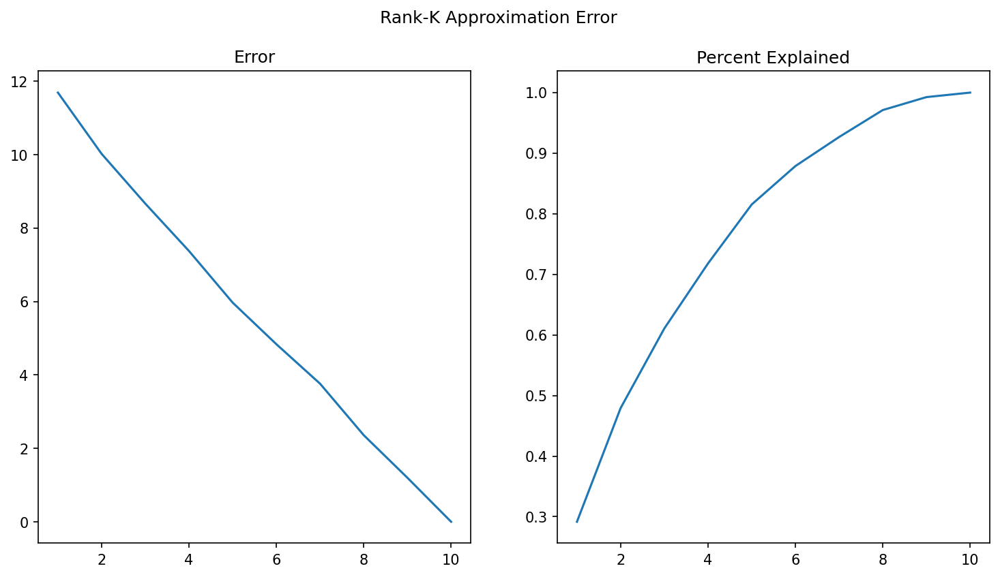

## Week 2 Monday Notes
### SVD Definitions and Examples
SVD definition: 

$$A=U \Sigma V^T$$

U is the eigenvectors of $AA^T$, V is the eigenvectors of $A^TA$, and $\Sigma$ is the square root of the eigenvalues of $AA^T$ and $A^TA$, which are the same numbers.

Geometric Interpretation: 

The first multiplication by $V^T$ rotates to the principal axes, the $\Sigma$ scales the axes, and the last $U$ rotates it again to the output coordinate system. $A^TA=V \Sigma^T \Sigma V^T$, which means that the $\Sigma$ diagonal matrix gets squared. The square root of the eigenvalues of $A^TA$ needs to be taken to get the singular values ($\sigma$)  

#### Example 1
$$
A=\begin{bmatrix}
3 & 0 \\
0 & 2
\end{bmatrix}
$$

$$
A^TA=\begin{bmatrix}
9 & 0 \\
0 & 4
\end{bmatrix}
$$

$$
V=\begin{bmatrix}
1 & 0 \\
0 & 1
\end{bmatrix}
$$

$$
\Sigma=\begin{bmatrix}
\sqrt{9} & 0 \\
0 & \sqrt{4}
\end{bmatrix}=\begin{bmatrix}
3 & 0 \\
0 & 2
\end{bmatrix}
$$

$$
AA^T=\begin{bmatrix}
9 & 0 \\
0 & 4
\end{bmatrix}
$$

$$
U=\begin{bmatrix}
1 & 0 \\
0 & 1
\end{bmatrix}
$$

$$
\Sigma=\begin{bmatrix}
\sqrt{9} & 0 \\
0 & \sqrt{4}
\end{bmatrix}=\begin{bmatrix}
3 & 0 \\
0 & 2
\end{bmatrix}
$$

$$
A=U \Sigma V^T=\begin{bmatrix}
1 & 0 \\
0 & 1
\end{bmatrix}\begin{bmatrix}
3 & 0 \\
0 & 2
\end{bmatrix}\begin{bmatrix}
1 & 0 \\
0 & 1
\end{bmatrix}=\begin{bmatrix}
3 & 0 \\
0 & 2
\end{bmatrix}
$$

#### Example 2
$$
A=\begin{bmatrix}
1 & 1 \\
0 & 1
\end{bmatrix}
$$

$$
A^TA=\begin{bmatrix}
1 & 1 \\
1 & 2
\end{bmatrix}
$$

$$
V=\begin{bmatrix}
\frac{-1+\sqrt{5}}{2} & \frac{-1-\sqrt{5}}{2} \\
1 & 1
\end{bmatrix} \approx \begin{bmatrix}
0.618 & -1.618 \\
1 & 1
\end{bmatrix} 
$$

$$
||V|| \approx \begin{bmatrix}
0.528 & -0.851 \\
0.851 & 0.528
\end{bmatrix} 
$$

$$
\Sigma= \begin{bmatrix}
\sqrt{\frac{3+\sqrt{5}}{2}} & 0 \\
0 & \sqrt{\frac{3-\sqrt{5}}{2}}
\end{bmatrix} \approx \begin{bmatrix}
1.618 & 0 \\
0 & 0.618
\end{bmatrix}
$$

$$
AA^T=\begin{bmatrix}
2 & 1 \\
1 & 1
\end{bmatrix}
$$

$$
U=\begin{bmatrix}
\frac{1+\sqrt{5}}{2} & \frac{1-\sqrt{5}}{2} \\
1 & 1
\end{bmatrix} \approx \begin{bmatrix}
1.618 & -0.618 \\
1 & 1
\end{bmatrix} 
$$

$$
||U|| \approx \begin{bmatrix}
0.851 & -0.528 \\
0.528 & 0.851 
\end{bmatrix}
$$

$$
\Sigma=\begin{bmatrix}
\sqrt{\frac{3+\sqrt{5}}{2}} & 0 \\
0 & \sqrt{\frac{3-\sqrt{5}}{2}}
\end{bmatrix} \approx \begin{bmatrix}
1.618 & 0 \\
0 & 0.618
\end{bmatrix}
$$

$$
A=||U|| \Sigma ||V^T||= \begin{bmatrix}
0.851 & -0.528 \\
0.528 & 0.851 
\end{bmatrix} \begin{bmatrix}
1.618 & 0 \\
0 & 0.618
\end{bmatrix} \begin{bmatrix}
0.528 & 0.851 \\
-0.851 & 0.528
\end{bmatrix} \\
A= \begin{bmatrix}
1.3177 & -0.3263 \\
0.8543 & 0.5259
\end{bmatrix} \begin{bmatrix}
0.528 & 0.851 \\
-0.851 & 0.528
\end{bmatrix} = \begin{bmatrix}
1 & 1 \\
0 & 1
\end{bmatrix} 
$$

### Discrete Time Signals and System Properties- Oppenheim 2.0-2.2.5

- Linearity- The signal needs to be linear. It needs to meet additivity and homogeneity. Physically, it means that you can add or scale signals.

- Time Invariance- a time shift in the input produces an identical time shift in the output

- Memoryless- The signal does not depend on information from previous signals.

- Causality- The signal does not depend on information from signals in the future.

- Stability- Bounded Input, Bounded Output

An important note: A memoryless system is always causal, but a causal system is not necessarily memoryless.

For the Unity implementation of the White Cane:
- Linearity- No, the vibration signal itself could be additive and scaled. However, the transition probabilities in the markov chain cannot be scaled.
- Time Invariance- No, the surface signal depends on the the state at the time before, so the signals produced are dependent on the internal state. 
- Memoryless- No, the state machine needs to know where it was previously
- Causality- Yes, the state machine only looks at where it was previously
- Stability- Yes, and needs to be for safety reasons.

This means the system is not Linear-Time Invariant (LTI). 

## Week 2 Tuesday Notes
### Python SVD Implementation
- Reconstructed $A=U \Sigma V^T$ in Python
  - Python SVD implementation gives a 1-D array of eigenvalues. Need to use np.diag() to create a diagonal matrix 
- Created a Rank-K Approximation via Slicing
  - Only need the top K eigenvalues and eigenvectors of $U,\Sigma,V^T$
  - Error is calculated using Frobenius Norm: 
   
   $$||A-A_{Approx}|| = \sqrt{\sum_{i=1}^{m}\sum_{j=1}^{n}|a_{ij}-b_{ij}|^2}$$

  - Percent Explained uses the Eigvalue matrix:
   
   $$PctExp = \frac{\sum_{i=1}^{k}\sigma_{i}^{2}}{\sum_{i=1}^{n}\sigma_{i}^{2}}$$
   
- Plotted Error and Percent Explained vs k

- Identified thresholds at which XX% of variance explained

